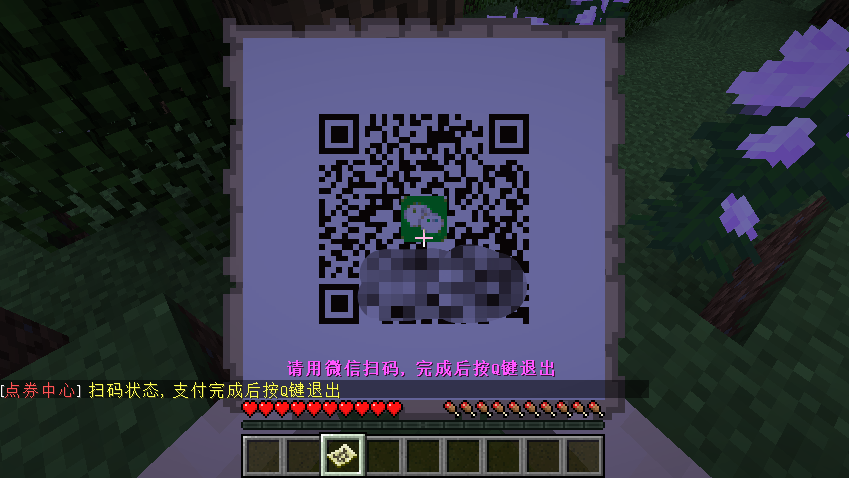

# 关于MCRMB

## 平台简介
  
MCRMB是国内首个Minecraft充值解决方案平台，从2014年运营至今。  
平台地址：[https://www.mcrmb.com](https://www.mcrmb.com/)

!> Minecraft版权在国内归网易公司所有，请在遵守EULA的情况下运营服务器。

## 我们提供

### 充值渠道

* 支付宝
* 微信
* QQ钱包
* 卡密充值

?> 充值方式：在线网页充值、游戏内地图扫码、接口下单充值。

### 提现渠道

* 支付宝
* QQ钱包
* 银行卡
* 微信一清结算 `D1结算到银行卡`
* 支付宝一清结算 `实时结算支付宝`

### 工作模式

* 核心插件+配套子插件配置商品、VIP；
* McrmbBuyCommander模式，单行指令配置商品及点券金额；
* 转入PlayerPoints模式；
* 转入执行自定义指令模式；
* PlayerPoints挂钩模式；
* 发卡模式；

?> 配套服务端插件：[https://ci.mcrmb.com](http://ci.mcrmb.com/)  
发卡模式服务器内需要自行安装可以生成卡的插件~

## 资金安全

MCRMB为您的资金安全提供了最有力的保障：**一清模式**  
所有其他平台的资金均为先结算到平台，再由平台结算到服主，俗称**二清**，该方式一旦平台被罚、倒闭、恶意跑路，则造成服主资金损失。  
一清模式下，MCRMB平台仅处理订单，不介入您的资金流，玩家的充值由微信、支付宝直接结算至您的银行卡/支付宝账户，彻底杜绝平台跑路的可能性。

## 平台资质

* 营业执照
* [网络文化经营许可](http://sq.ccm.gov.cn/ccnt/sczr/service/business/emark/toDetail/bc72295cc6ab42d9af7b27927a8769c6)
* [公安备机关案](http://www.beian.gov.cn/portal/registerSystemInfo?recordcode=44010602002006)
* [ICP备案](http://www.beian.miit.gov.cn/)

## 选择MCRMB

* **资金最安全**，平台支持`一清模式`；
* **资质够齐全**，MCRMB拥有`网络游戏虚拟货币发行`资质；
* **页面自定义**，例如充值页面LOGO，充值网址可以挂自己的官网；
* **个性化域名**，支持绑定`自己的域名(提供免备案服务)`，同时提供`二级域名`；
* **节省服主玩家时间**，服主无需费神费力，玩家无需苦苦等待；
* **兼容性强**，只要您的服务器能访问网络，即可用，即便是内网HAMACHI；
* **安装低门槛**，只要您的服务器能装插件，即可使用，无需独立服务器；
* 可**自定义给予玩家的费率**，例如移动卡100%，QQ卡80%；
* 支持**`十余种卡密`**以及**`支付宝`**和**`微信`、`QQ钱包`**充值；
* 已**支持计分板、PlayerPoints、游戏内地图扫码** 等功能；

?>MCRMB核心插件`2.0b12`版本起  
扫码功能已经支持`KCauldron`服务端、`CatServer`服务端

## 工作流程

1. 玩家购买好支持的充值卡、或准备好支付方式；
2. 玩家通过`网页系统`充值或`服务器内扫码/提卡密`进行充值；
3. 支付`处理成功`，即充值成功后，玩家的点券将自动添加到个人账号；（**此时卡密充值的钱到达服主MCRMB账户内，等待提现**）
4. 玩家在服务器内输入指令`购买Vip(McrmbVip插件)`或`购买物品(McrmbShop插件)`，进行消费；
5. 系统将自动判断玩家点券`是否足够`，并进行扣取，记录，及自动发放（采用指令发放）；
6. 若商品为VIP，我们提供的插件已经实现自动上Vip权限以及自动下Vip权限（采用指令处理）；
7. 服主提现捐助款时，可以使用`支付宝、QQ钱包、银行卡`；

?> 核心插件中提供了查询、消费、支付事件等接口，有开发能力的服主可以直接对接进行开发  
[核心插件接口文档](/apis/core-plugin-api) [接口示范插件及源码](https://gitee.com/mcrmb/mcrmb_sub_plugin_test)

## 历史改进

[跳转查看](history)

