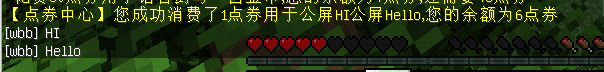

# McrmbBuyCommand

## 简介

该插件的作用接近于McrmbShop，主要功能为定义商品的发放。  
不同之处是McrmbShop插件需要在配置文件里定义好商品信息，而McrmbBuyCommand插件的商品信息定义在指令当中，**指令内容就是配置内容**。

!>**因此，该插件的指令绝对不能让普通玩家直接有权限执行。**  
通常情况下由其他插件来执行McrmbBuyCommand的指令，或服主在后台测试指令时可以直接执行，最新版本的McrmbBuyCommand插件已经限制非后台执行指令。

## 指令

/bbuy &lt;目标玩家&gt; &lt;点券价格&gt; &lt;消费说明/商品名&gt; &lt;商品命令，使用中文分号`；`分割&gt;

<table>
  <thead>
    <tr>
      <th style="text-align:left">&#x53C2;&#x6570;</th>
      <th style="text-align:left">&#x8BF4;&#x660E;</th>
    </tr>
  </thead>
  <tbody>
    <tr>
      <td style="text-align:left">&#x76EE;&#x6807;&#x73A9;&#x5BB6;</td>
      <td style="text-align:left">&#x73A9;&#x5BB6;&#x540D;&#xFF0C;&#x8BE5;&#x64CD;&#x4F5C;&#x6267;&#x884C;&#x540E;&#x7684;&#x76EE;&#x6807;&#x73A9;&#x5BB6;&#x540D;</td>
    </tr>
    <tr>
      <td style="text-align:left">&#x70B9;&#x5238;&#x4EF7;&#x683C;</td>
      <td style="text-align:left">&#x8BE5;&#x64CD;&#x4F5C;/&#x5546;&#x54C1;&#x9700;&#x8981;&#x6D88;&#x8017;&#x76EE;&#x6807;&#x73A9;&#x5BB6;&#x591A;&#x5C11;&#x4E2A;&#x70B9;&#x5238;&#xFF1F;</td>
    </tr>
    <tr>
      <td style="text-align:left">&#x6D88;&#x8D39;&#x8BF4;&#x660E;/&#x5546;&#x54C1;&#x540D;</td>
      <td style="text-align:left">&#x4EC5;&#x8BB0;&#x5F55;&#x7528;</td>
    </tr>
    <tr>
      <td style="text-align:left">&#x5546;&#x54C1;&#x547D;&#x4EE4;</td>
      <td style="text-align:left">
        <p>&#x4F7F;&#x7528;&#x4E2D;&#x6587;&#x5206;&#x53F7;&#xFF1B;&#x5206;&#x5272;&#x7684;&#x591A;&#x4E2A;&#x9884;&#x8BBE;&#x6307;&#x4EE4;&#xFF0C;&#x5176;&#x4E2D;{player}&#x4E3A;&#x73A9;&#x5BB6;&#x540D;&#x53D8;&#x91CF;&#x3002;</p>
        <p>&#x4EE5;op:&#x5F00;&#x5934;&#x7684;&#x6307;&#x4EE4;&#x5C06;&#x4E34;&#x65F6;&#x7ED9;&#x4E88;&#x73A9;&#x5BB6;&#x6743;&#x9650;&#x5E76;&#x7531;&#x73A9;&#x5BB6;&#x6267;&#x884C;&#x3002;</p>
        <p></p>
        <p>&#x4F8B;&#xFF1A;</p>
        <p><code>op:say hi&#xFF1B;eco give {player} 100</code>
        </p>
        <p>&#x4EE5;&#x4E0A;&#x6307;&#x4EE4;&#xFF0C;&#x73A9;&#x5BB6;&#x5C06;&#x4EE5;OP&#x8EAB;&#x4EFD;&#x53D1;&#x5E03;&#x5168;&#x670D;&#x516C;&#x544A;&#x201C;hi&#x201D;&#xFF08;&#x7531;&#x73A9;&#x5BB6;&#x8EAB;&#x4EFD;&#x6267;&#x884C;&#xFF09;&#xFF0C;&#x5E76;&#x83B7;&#x5F97;100&#x4E2A;&#x91D1;&#x5E01;&#xFF08;&#x7531;&#x540E;&#x53F0;&#x6267;&#x884C;&#xFF09;</p>
      </td>
    </tr>
  </tbody>
</table>## 指令结构


###  指令示范1

`/bbuy wbb 50 钻石剑与一百金币 give {player} 276 1；eco give {player} 100` 

该指令执行之后，会作出以下操作：

* 检测玩家wbb是否有50点券并扣款 
* 扣款成功则后台执行2个指令： give wbb 276 1 及 eco give wbb 100 
* 扣款失败则不执行任何指令，通知玩家wbb提示点券不足。 

####  后台效果

（注意，本插件实际运用应结合其他可以【执行后台指令】的插件，而不是服主手工在后台打指令。）


#### 前台效果


### 指令示范2

`/bbuy wbb 100 公屏HI公屏Hello op:say HI；op:say Hello` 

该指令执行之后，会作出以下操作：

* 检测玩家wbb是否有100点券并扣款
* 扣款成功则后台执行2个指令： 给wbb临时op，强制其执行say HI； 给wbb临时op，强制其执行say Hello 
* 扣款失败则不执行任何指令，通知玩家wbb提示点券不足。

#### 后台效果


#### 前台效果




## 配合其他插件用法（请阅读）

### 配合 ChestCommands 灵活运用

```text
COMMAND: 'console: bbuy {player} 50 购买钻石剑与100金币 give {player} 276 1；eco give {player} 100'
```

这样配置可以实现玩家点击按钮之后进行点券消费购买道具及金币。

?>注意，ChestCommand的玩家名变量为{player}，虽然与McrmbBuyCommand一样，但不会冲突，不必担心。
### 配合 Bossshop 灵活运用

```text
RewardType: command
Reward:
- bbuy %player% 50 购买钻石剑与100金币 give {player} 276 1；eco give {player} 100
```

这样配置可以实现玩家点击按钮之后进行点券消费购买道具及金币。

?> 注意，Bossshop的玩家名变量为 %player%，但McrmbBuyCommand自身有变量名可以获取玩家名，所以上面的指令，后面的2个 {player} 写成 %player% ，其实也是可以的。  
写{player}，玩家点击后，服务器会执行 【bbuy 玩家名 50 购买钻石剑与100金币 give {player} 276 1;eco give {player} 100】，实现玩家的购买。  
写%player%，玩家点击后，服务器会执行【bbuy 玩家名 50 购买钻石剑与100金币 give 玩家名 276 1;eco give 玩家名 100】，依然实现玩家的购买。  

## 插件下载

http://ci.mcrmb.com/job/McrmbBuyCommand/

?>CI持续构建平台（ci.mcrmb.com）看上去很复杂，其实只需要点进相应的项目，拉到下方，找到最终成功构建，下载jar文件即可，Mcrmb平台各插件均在CI发布。
